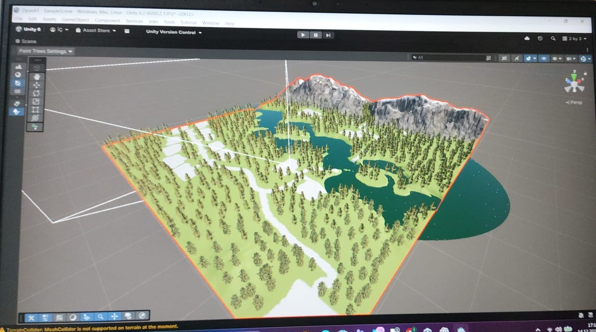
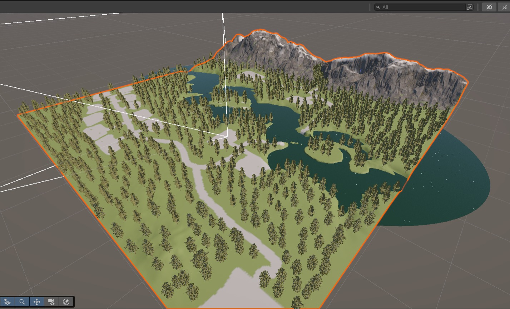
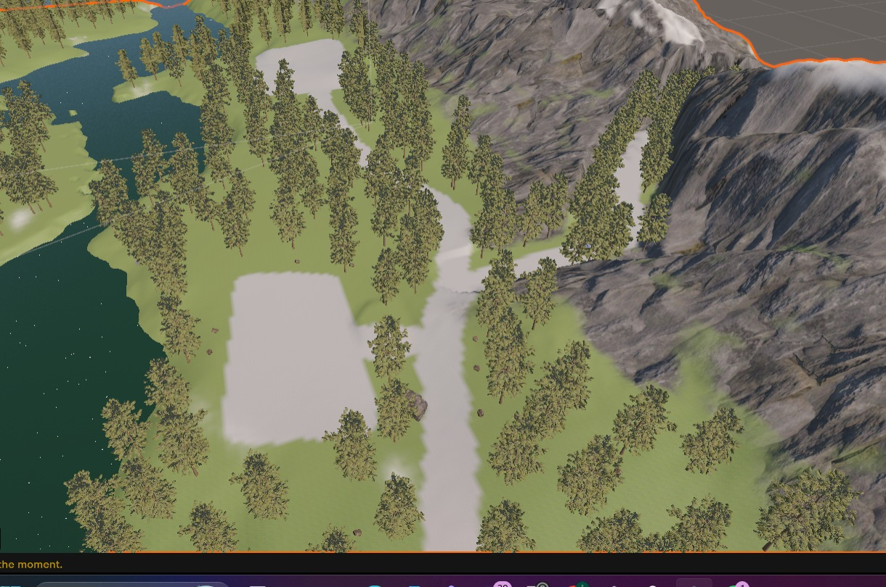

# 3D Island Level Design & Visual Portfolio

Unity 6 oyun motoru ve Blender kullanılarak açık dünya (Open World) konseptinde tasarlanmış, geliştirme aşamasındaki bir 3D ada haritası projesidir. 

> ⚠️ **Teknik Not:** Projenin ana sahne dosyaları (`.unity` / `.fbx`) geliştirme sürecinde yaşanan teknik bir veri bozulması (file corruption) nedeniyle erişilemez hale gelmiştir. Bu depo; projenin topoğrafya yapısını, seviye tasarım (level design) mantığını ve görsel vizyonunu belgelemek amacıyla süreç esnasında alınan yüksek çözünürlüklü ekran görüntüleriyle bir **Görsel Portfolyo** olarak derlenmiştir.

---

## 🛠️ Kullanılan Teknolojiler & Araçlar
* **Unity 6:** Terrain (Arazi) Tasarımı, Paint Trees & Detail araçları, Su (Water System) Shader entegrasyonları ve global ışıklandırma.
* **Blender:** Çevre elementleri (Dağ kütleleri, kayalıklar ve bitki örtüsü) optimizasyonu ve düşük poligonlu (Low-Poly) modelleme pratikleri.

---

## 🗺️ Tasarım Süreci ve Seviye Analizi

### 1. Genel Topoğrafya ve Kuşbakışı Kuşatım (Level Layout)

* **Tasarım Mantığı:** Oyuncunun harita üzerindeki serbestliğini kısıtlamadan yön bulmasını kolaylaştırmak adına doğal sınırlar (dağ sıraları ve su yolları) kullanılmıştır. Ada, oyuncuyu keşfe zorlayacak stratejik merkez noktalarına ayrılmıştır.

### 2. Doğal Odak Noktaları ve Su Akış Dinamikleri

* **Teknik Detay:** Unity Terrain araçlarıyla derinlik matrisi oluşturulmuş, adayı besleyen nehir yatakları ve gölet alanları tasarlanmıştır. Dağ yükseltileri, oyuncunun görüş açısını (Line of Sight) yönetmek ve haritanın arkasındaki yükü optimize etmek amacıyla konumlandırılmıştır.

### 3. Oyuncu İlerleme Yolları (Player Pathing)

* **Tasarım Mantığı:** Harita içerisindeki yol ağları, oyuncunun oyun içi dinamiklerle (görevler, düşman yerleşimleri, kaynaklar) organik bir şekilde karşılaşmasını sağlayacak kıvrımlı bir yapıda kurgulanmıştır. Bitki örtüsü yoğunluğu yol kenarlarında optimize edilmiştir.

---

## 🚀 Gelecek Planları
* Kaybedilen kaynak dosyaların bu görsel şema üzerinden reverse-engineering (tersine mühendislik) ile yeniden inşa edilmesi.
* Haritaya dinamik hava durumu (Dynamic Weather) ve gece-gündüz döngüsü entegre edilmesi.

---

## 📬 İletişim & Bağlantılar
* **E-posta:** ilyas.cetin@ogr.ksbu.edu.tr
* **LinkedIn:** [linkedin.com/in/ilyas-çetin-b753082b6](https://linkedin.com/in/ilyas-çetin-b753082b6)
* **GitHub:** [github.com/ilyascetin-debug](https://github.com/ilyascetin-debug)
